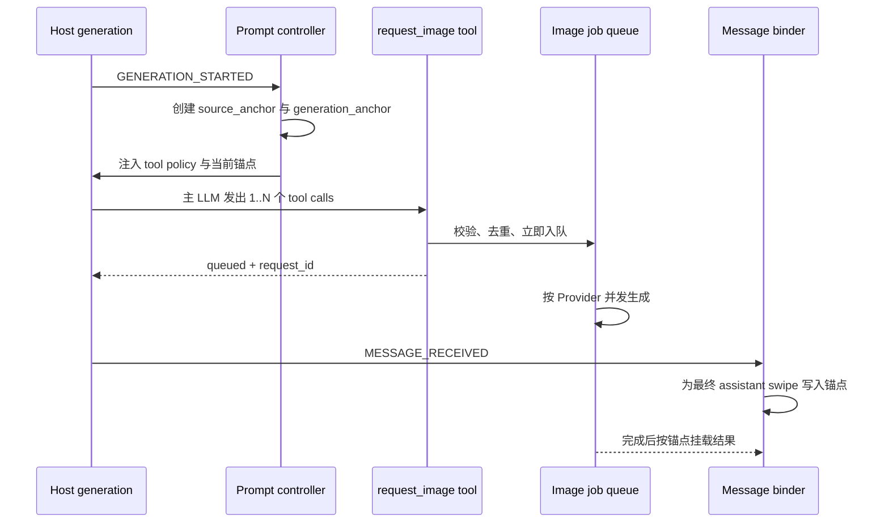

# TavernCanvas v3 完全重构设计

- 日期：2026-08-04
- 状态：已确认，文件级实施计划已完成
- 目标版本：v3
- 适用仓库：`tavern-canvas`
- 英文产品名：`TavernCanvas`
- 简体中文显示名：`智绘姬`
- GitHub：`https://github.com/ITOTI-Y/tavern-canvas`
- workspace scope：`@tavern-canvas`

## 1. 背景与问题

当前扩展以约 3.7 MB 的单一 `index.js` 为运行主体，HTML、CSS、业务逻辑、Provider 调用、持久化、消息绑定和兼容判断高度耦合。仓库缺少可维护源码边界、类型契约、自动化测试和稳定构建输入。相同功能存在多套状态与 UI 实现，设置同时分布于 `extension_settings`、`localStorage`、多个 IndexedDB 和消息 metadata。旧迁移逻辑还存在失败后写入成功标志的风险。

生图触发依赖提示标记与 World Info 控制，主 LLM、绘图提示词 LLM、Provider 请求和最终消息之间缺少稳定的任务身份。异步生成、tool recursion、切换聊天和切换 swipe 后，结果容易依赖“当前最后一层”而挂载到错误消息。

v3 采用 clean cutover。重构前已提交代码只作为行为参考和迁移输入，已从旧仓库 `HEAD` 归档至被忽略的 `data/_archive/raw_st_chatu8_v2_8_1_20260804.tar.gz`，不进入正式运行路径或新公开仓库历史。

## 2. 目标

v3 必须满足以下目标：

1. 使用 Vue 3、TypeScript、Vite 和运行时微内核重建扩展。
2. 保留现有用户功能，并按业务能力重新组织，删除重复实现和失效路径。
3. 主 LLM 优先通过 SillyTavern 原生 function tool 发起生图请求；不支持 tools 时使用隐藏指令 fallback。
4. 每次主回复链生成唯一锚点，使并发图像任务在切聊天、tool 中间层和 swipe 变化后仍能绑定正确 assistant 消息。
5. 以 SillyTavern 与 JS Slash Runner 为硬性宿主基线，同时兼容 TauriTavern 和独立 Gateway。
6. 独立 Gateway 支持局域网 HTTP，并对明文传输做显式、非阻塞风险提示。
7. 将配置、任务、图片、词库和消息 metadata 分层持久化，实现无损、可恢复迁移。
8. 词库独立于扩展代码更新，并在手机等低内存设备上保持可用检索性能。
9. 首发提供简体中文和英文双语 UI。
10. UI 采用 minimal studio workbench，统一 Lucide 图标，第一方界面禁止 emoji，达到高质量设计作品的完成度。
11. 通过 contract、integration、E2E、视觉回归和性能预算证明功能与兼容性。

## 3. 非目标

v3 首次发布不开放第三方运行时代码插件 API，不加载远程 JavaScript，不承担第三方权限、签名和沙箱治理。Provider、UI 和功能模块均为仓库内受信模块。

World Info 可以继续作为角色、资料和上下文数据源，但不再承担主 LLM 生图行为控制。

v3 不保留旧 `index.js` 双运行模式、旧全局变量别名、旧 DOM selector 兼容层或静默数据修复逻辑。

## 4. 已核对的宿主基线

本设计基于 2026-08-04 获取的源码与公开契约：

| 组件 | 基线版本 | 使用的稳定契约 |
|---|---:|---|
| SillyTavern | 1.18.0 | extension manifest、generation events、ToolManager、`setExtensionPrompt`、chat/message metadata、图片上传路由 |
| TauriTavern | 2.2.0 | `window.__TAURITAVERN__.ready`、ChatSurface、WorldInfo activation、兼容 Provider 路由 |
| JS Slash Runner | 4.9.1 | `window.TavernHelper`、`generate`、消息与变量 API、typed events |

`setExtensionPrompt` 支持 `IN_CHAT`、depth、role 和 World Info scan 控制。v3 使用 `IN_CHAT`、`depth=0`、`role=SYSTEM`、`scan=false`，使主 LLM 控制提示进入最终 prompt，同时不参与 World Info 扫描。

SillyTavern ToolManager 会在 tool action 完成后记录 invocation，并递归启动下一轮生成。v3 的 tool action只完成校验和入队，立即返回 `queued`；长期图像任务在独立队列中并发执行。

## 5. 仓库与构建结构

仓库采用 `pnpm workspace`：

```text
apps/
  extension/
    src/
      bootstrap/
      host/
      kernel/
      modules/
        generation/
        prompt/
        providers/
        library/
        gallery/
      ui/
    public/
      i18n/
      vocabulary/
  gateway/
    src/
      api/
      jobs/
      providers/
      storage/
packages/
  contracts/
    src/
      generation/
      gateway/
      providers/
      storage/
tools/
  v2_migration/
  vocabulary_builder/
data/
  _archive/                 # 本地旧版归档，整目录忽略
docs/
  plans/
```

正式构建仍生成 SillyTavern 可安装扩展：

```text
dist/index.js
dist/index.css
dist/chunks/*
dist/assets/*
manifest.json
i18n/*
```

`manifest.json` 设定：

- `minimum_client_version: "1.18.0"`
- `loading_order: 110`，晚于 JS Slash Runner 的 100
- `auto_update: true`
- `dependencies: ["JS-Slash-Runner"]`
- `i18n` 映射包含 `en`，简体中文作为基础 manifest 文案
- `homePage: "https://github.com/ITOTI-Y/tavern-canvas"`

SillyTavern 的 `requires/optional` 表示 server modules；`dependencies` 表示扩展依赖。JS Slash Runner 是 v3 硬依赖，缺少或禁用时由宿主阻止 TavernCanvas 激活。manifest 不能表达扩展依赖的最低版本，因此 bootstrap 还必须通过 `getTavernHelperVersion()` 校验 JS Slash Runner 不低于 `4.9.1`；版本不足时终止启动，并显示明确更新入口。

公开仓库使用英文名称 `TavernCanvas`，仓库 slug 为 `tavern-canvas`，workspace package scope 为 `@tavern-canvas`。简体中文 UI 继续使用“智绘姬”作为显示名。

框架采用经工具链 peer dependency 验证的稳定版本并锁定完整依赖图：Vue 3、Vite 8、TypeScript 6.0.3、Zod 4、Express 5、Vitest 4 和 Playwright 1。TypeScript 7 待 `typescript-eslint` 正式支持后再升级，不以关闭 type checked lint 为代价追逐编译器版本。运行时不得从 CDN 加载库。Gateway 运行于 Node.js 24 LTS。Node `node:sqlite` 在审计时仍为 release candidate，因此 Gateway 使用成熟 SQLite driver，不依赖未稳定 API。

## 6. 运行时微内核

### 6.1 内核职责

内核只负责：

1. 注册受信模块。
2. 解析模块依赖并执行拓扑排序。
3. 管理 `activate` 与 `deactivate` 生命周期。
4. 提供类型化 domain event bus。
5. 提供 command/query capability registry。

模块契约示意：

```ts
interface ModuleManifest {
  module_id: string;
  module_version: string;
  requires: string[];
  optional: string[];
  provides: string[];
}

interface RuntimeModule {
  manifest: ModuleManifest;
  activate(runtime_context: RuntimeContext): Promise<Disposable>;
}
```

动态加载只允许构建时生成的本地白名单：

```ts
const builtin_modules = {
  "provider.sd": () => import("../modules/providers/sd"),
  "provider.novelai": () => import("../modules/providers/novelai"),
  "provider.comfyui": () => import("../modules/providers/comfyui"),
};
```

内核拒绝重复 capability provider、循环硬依赖和不满足的核心依赖。核心模块失败时中止启动并显示诊断；optional module 失败时隔离该模块，其余模块继续运行。

### 6.2 Host 适配

Host 层包含 3 个适配器：

- `sillytavern_host`：聊天、消息、generation events、ToolManager、图片上传和宿主设置。
- `tavern_helper_host`：`generate`、变量、消息工具和版本查询。
- `tauritavern_host`：ChatSurface、WorldInfo activation 和 Tauri 增强路由。

业务模块禁止直接访问 `window.TavernHelper`、`window.__TAURITAVERN__`、jQuery、宿主 DOM 或内部模块路径。所有 capability 探测与降级都集中在 Host 层。

`tavern_helper_host` 是核心 capability。bootstrap 只有在 TavernHelper 全局对象存在、公开 API 完整且版本满足要求后才激活内核；`tauritavern_host` 仍为可选增强 capability。

### 6.3 模块通信

跨模块通信只允许：

- 同步 command/query capability，用于有明确请求方和返回值的操作。
- 异步 domain event，用于任务状态、结果完成、聊天切换和数据更新通知。

Provider、存储和 UI 不能互相 import。Vue 组件不能直接 `fetch`、读写 `extension_settings` 或操作聊天 DOM。所有边界输入先通过 `packages/contracts` 中的 Zod schema。

## 7. 主 LLM 生图触发

### 7.1 Generation session 与锚点

主生成链开始时，`generation_session` 规范化即将发送给主 LLM 的当前上下文：

```ts
interface SourceContext {
  schema_version: 1;
  chat_id: string;
  active_swipes: Array<{
    message_id: number;
    swipe_id: number;
  }>;
  messages: Array<{
    message_id: number;
    role: "user" | "assistant" | "system";
    content_sha256: string;
    swipe_id: number | null;
  }>;
}
```

锚点计算：

```text
source_anchor = SHA-256(canonical_json(source_context))
generation_anchor = SHA-256(source_anchor + random_invocation_id)
```

`source_anchor` 标识输入上下文，`generation_anchor` 区分相同上下文上的 regenerate。`random_invocation_id` 使用 `crypto.getRandomValues`。SHA-256 使用随扩展打包的 `@noble/hashes`，确保局域网 HTTP 页面在没有 `crypto.subtle` 时仍可运行。

模型只复制插件注入的 `generation_anchor`，不计算哈希。tool recursion 通过 generation depth 与根会话 registry 复用同一锚点。

### 7.2 原生 function tool

主路径注册非 stealth 的 `request_image`：

```ts
interface RequestImageArguments {
  generation_anchor: string;
  scene_description: string;
  negative_constraints?: string;
  context_turns?: number;
  style_preset_id?: string;
  image_count?: number;
}
```

约束：

- `context_turns` 范围为 0–12。
- `image_count` 范围为 1–4。
- 主 LLM 不能传 Provider URL、密钥、任意 headers 或未校验后端参数。
- tool action 校验当前 session、锚点和 schema，生成 `request_id` 后立即入队。
- tool 结果只返回 `queued`、`request_id` 和 `generation_anchor`。

主提示只注入当前锚点、何时调用 tool、先调用再输出正文 3 项规则。绘图提示词 LLM 通过独立 generation request 调用，并显式设置 `tools: []` 与 `tool_choice: "none"`，防止调用自身。

### 7.3 非 tool fallback

当主模型不支持 function calling 时，插件注入唯一 fallback grammar：

```html
<!-- tavern-canvas:image {"generation_anchor":"ig_...","scene_description":"..."} -->
```

解析器规则：

- 只监听当前 generation session，不扫描历史消息。
- 支持 comment 被流式 chunk 拆分。
- 只有收到完整闭合 comment 后才解析。
- 限制最大长度、字段、数组数量和字符串长度。
- 只接受与当前 session 完全相同的 `generation_anchor`。
- 原生 tool 模式下禁用 fallback parser。
- 最终消息落盘时删除 comment，并将结构化请求保存到 metadata。

HTML comment 在聊天渲染中不可见。解析与清理均针对原始消息文本，不依赖渲染 DOM。

## 8. 异步任务、并发与消息绑定

### 8.1 执行时序



SillyTavern ToolManager 当前按顺序调用 tool action。v3 的 action 只入队，因此多个调用会快速返回，实际 Provider 任务由队列并发执行。主 LLM 随后递归生成最终文本，图像任务无需等待正文完成。

### 8.2 去重与任务状态

任务幂等键：

```text
request_digest = SHA-256(generation_anchor + canonical_json(tool_arguments))
```

同一 generation session 中重复的 `request_digest` 只创建一个任务。用户显式重复生成会获得新的 `request_id`，不与自动去重混淆。

状态机：

```text
queued -> preparing -> submitting -> running
running -> completed | failed | cancelled
completed -> attached | orphaned
```

所有转换验证前置状态。取消操作幂等，每个任务持有独立 `AbortController`。Provider 并发数按配置和能力限制，默认全局并发小于或等于 4。

### 8.3 Assistant swipe metadata

最终 assistant 消息通过 `MESSAGE_RECEIVED` 绑定，跳过 tool、system 和其他中间层。当前 active swipe 保存：

```ts
interface TavernCanvasMessageMetadata {
  schema_version: 1;
  generation_anchor: string;
  source_anchor: string;
  request_ids: string[];
  image_ids: string[];
}
```

结果挂载必须同时匹配 `chat_id`、`generation_anchor` 和 `swipe_id`。切换聊天后任务继续运行；返回目标聊天时恢复观察并挂载。目标消息或 swipe 已删除时，结果进入图库并标记 `orphaned`，不能附到当前最后一条消息。

标准 SillyTavern 通过消息 metadata、`extra.media`、保存与刷新 API 更新。TauriTavern 优先使用 ChatSurface。业务层不接触 DOM。

## 9. Provider 与传输

### 9.1 Provider capability

每个 Provider 声明：

```text
text_to_image
image_to_image
reference_image
progress
cancel
seed
workflow
streaming_result
```

共享请求使用 discriminated union。ComfyUI workflow、NovelAI vibe、Google reference image 和其他特有字段位于各自 schema，不进入无类型 `options` 容器。

运行时选择：

| 环境 | 首选 transport |
|---|---|
| 标准 SillyTavern | `host_proxy_transport` |
| TauriTavern | `tauri_transport` |
| 独立部署 | `gateway_transport` |
| 浏览器直连 | 默认关闭，仅显式允许本机端点 |

### 9.2 Provider error contract

上游异常映射为稳定错误码：

```text
auth_failed
rate_limited
content_blocked
invalid_request
provider_unavailable
timed_out
cancelled
malformed_response
```

只有网络错误、408、429 和可恢复 5xx 自动重试。重试尊重 `Retry-After`，使用指数退避与 jitter，最多 2 次。认证、schema、内容审核和参数错误直接失败。

## 10. 独立 Gateway

### 10.1 API

Gateway 使用 Express 5 与共享 Zod contracts：

```text
GET    /v1/capabilities
POST   /v1/jobs
GET    /v1/jobs/:job_id
GET    /v1/jobs/:job_id/events
DELETE /v1/jobs/:job_id
POST   /v1/assets
GET    /healthz
```

`POST /v1/jobs` 返回 `202` 与 `job_id`。SSE 提供任务事件；不可用时客户端使用带退避轮询。`request_id` 是唯一幂等键。

Gateway 使用 SQLite 保存 jobs、job_events、assets、idempotency_keys 和 schema_migrations，启用 WAL、foreign keys、busy timeout 和事务迁移。进程重启后恢复可确认状态的任务。

### 10.2 安全边界

- Provider base URL、模型白名单和密钥只存在 Gateway 配置中。
- 客户端请求不能覆盖上游 URL、headers 或认证信息。
- 远程 Gateway 支持 Bearer token；token 只授予图像任务权限，可轮换和撤销。
- CORS 使用精确 origin allowlist。
- 限制请求体、图片数量、像素数、任务并发和 SQLite 字段长度。
- 上传按 magic bytes 验证，随机命名，拒绝 SVG、HTML 和路径片段。
- 日志默认不记录 prompt、密钥、base64 和完整上游响应。
- `/v1/capabilities` 返回协议版本、Provider 能力和限制。协议主版本不兼容时客户端阻止提交。

### 10.3 HTTP 局域网策略

HTTP 与 HTTPS 都是受支持连接方式。插件不因 scheme 阻止任务。

HTTP endpoint 首次连接时显示风险：Bearer token、prompt 与图片会以明文经过网络。用户确认后按 origin 保存 acknowledgment，后续保留非阻塞状态标识。

- loopback 与私有网段显示“局域网 HTTP”提醒。
- 公网地址或无法判断的 hostname 显示更高风险提醒。
- 两种情况均允许用户继续。
- 文档提供局域网 HTTP 正式示例和公网 HTTPS reverse proxy 建议。

## 11. 数据所有权与存储

### 11.1 数据分层

| 数据 | 位置 | 规则 |
|---|---|---|
| 小型全局设置、UI 偏好 | `extension_settings.tavern_canvas` | Zod 校验，带 `schema_version` |
| 跨聊天业务数据 | `tavern_canvas_v3` IndexedDB | 使用 `idb` 与显式 upgrade transaction |
| 聊天绑定数据 | message/swipe metadata | 只保存锚点、ID 和必要展示 metadata |
| 词库数据包 | IndexedDB package/shard stores | 版本化、内容寻址、可原子切换 |
| Gateway 任务 | SQLite | jobs、events、assets、幂等键 |

浏览器 IndexedDB stores：

```text
provider_profiles
prompt_presets
comfy_workflows
novelai_vibes
character_profiles
regex_rules
knowledge_entries
vocabularies
vocabulary_groups
vocabulary_packages
vocabulary_shards
image_records
image_blobs
generation_jobs
migration_journal
```

Provider secret 使用宿主 secret 或 Gateway。Gateway access token 在普通浏览器扩展设置中无法抵御同源脚本读取，UI 必须如实说明该限制，不实现没有真实安全收益的本地伪加密。

### 11.2 图片缓存

图片 Blob 使用 SHA-256 内容寻址，metadata 与 Blob 分表。相同内容只保存一次。

缓存通过 `navigator.storage.estimate()` 读取配额，使用 LRU 清理未固定且已有宿主或 Gateway 持久 URL 的副本。消息仍唯一依赖本地 Blob 时禁止自动驱逐。图库删除、消息解绑和物理 Blob 回收分开执行，只有引用计数归零后才删除 Blob。所有 object URL 在视图卸载时 revoke。

### 11.3 `docs/_dev`

`docs/_dev/` 只用于本地开发参考，整个目录加入 `.gitignore`，不提交、不打包。`docs/_dev/DATA.md` 在本地登记持久化资产的 schema、flow、status 和 quality。真正的运行契约位于 `packages/contracts`，不能依赖被忽略文档。

## 12. 可更新词库与移动端检索

### 12.1 数据包协议

扩展附带可离线使用的 baseline package。词库更新与扩展代码发布解耦：

```ts
interface VocabularyPackageManifest {
  package_id: string;
  schema_version: number;
  data_version: string;
  changelog: string;
  record_count: number;
  compressed_size: number;
  minimum_extension_version: string;
  shards: Array<{
    shard_id: string;
    key_range: string;
    sha256: string;
    size: number;
  }>;
  indexes: Array<{
    kind: "prefix" | "alias" | "trigram" | "detail";
    shard_id: string;
    sha256: string;
    size: number;
  }>;
}
```

设置页提供“检查更新”和“更新”，展示版本、记录数变化、下载量和 changelog。只下载 hash 变化的分片。新数据先进入 staging namespace，逐片校验大小、SHA-256 和 schema，再原子切换 `active_data_version`。中断、格式错误或 hash 不一致时继续使用旧版本。

旧版本至少保留到新版本完成一次成功查询。更新数据只作为纯文本处理，不能携带脚本或 HTML。

### 12.2 检索模型

发布前由 `vocabulary_builder` 生成前缀、alias、trigram 候选和详情分片。浏览器使用 Web Worker 查询：

- 输入 debounce 120 ms。
- 新查询通过 `request_id` 取消旧查询。
- 首屏最多 50 条，继续滚动分页。
- 候选召回后最多加载 200 条详情。
- 精确、前缀和热门结果先返回，内容与模糊结果增量补充。
- Worker 只向主线程传输紧凑结果。
- 低内存或未知设备的 LRU 预算为 16 MB，桌面为 64 MB。
- 内存压力下先释放 trigram 与详情分片。

原始 JSON 保持可维护格式，二进制 package 与索引由 CI 生成。用户导入词库使用相同协议，索引在 Worker 中分批构建并显示进度。

## 13. v2 到 v3 无损迁移

迁移采用 copy、verify、switch：

1. 只读盘点旧 `extension_settings`、旧 IndexedDB 和当前聊天 metadata。
2. 写入可恢复 migration journal。
3. 在 v3 namespace 分批转换并执行 Zod 校验。
4. 图片计算 SHA-256 后去重复制。
5. 对每类数据核对记录数、关键字段和 Blob hash。
6. 全部通过后原子切换 active pointer。
7. 失败时保留 v2 数据和原 active pointer，并记录具体条目。

迁移失败不能写成功标志。旧数据库永不自动删除。设置页提供已验证备份导出和手动清理，清理前显示记录数与空间占用。

宿主没有可靠的全聊天枚举 API，因此消息 metadata 在聊天首次打开时原位升级并保存。所有 legacy converter 集中在 `tools/v2_migration` 和迁移边界，不能散落到业务模块。

导入导出采用流式 ZIP，包含 versioned manifest、JSON records、binary assets 和 SHA-256 清单。导入先在临时 namespace 完整校验，再原子切换。

## 14. Vue 工作台

### 14.1 Design Read

产品定位为面向 SillyTavern 重度用户的图像生成工作台，采用冷静 minimal、gallery-grade 图片呈现和精密工具交互。

```text
DESIGN_VARIANCE: 6
MOTION_INTENSITY: 4
VISUAL_DENSITY: 7
```

本地设计规范参考 `gpt-taste`、`design-taste-frontend`、`minimalist-ui` 和 `redesign-existing-projects`。其中 AIDA、hero、巨大章节间距、GSAP scroll pinning 和滚动劫持属于 landing page 模式，不进入高频产品工作台。用户明确要求 Lucide，覆盖 `minimalist-ui` 对 Lucide 的默认排除规则。

### 14.2 Shell 与导航

桌面端：

```text
56 px top command bar
64 px Lucide icon rail | fluid workspace | 320–400 px contextual inspector
persistent task strip at bottom
```

icon rail 包含工作台、Prompt、资产、图库、诊断和设置。contextual inspector 根据当前任务显示 Provider 参数、参考图或图片 metadata，可折叠和调宽。

手机端使用 top bar、单一内容层和底部 5 项导航。次要入口进入“更多”，inspector 变为可拖动全宽 sheet。布局使用 `100dvh` 与 safe area，不将桌面界面按比例缩小。

### 14.3 信息架构

| 区域 | 内容 |
|---|---|
| 工作台 | 当前 Provider、prompt、参考图、生成、活动任务 |
| Provider | SD、NovelAI、ComfyUI、OpenAI、Google、Gateway |
| Prompt | preset、质量词、替换规则、regex、LLM prompt builder |
| 资产 | 词库、角色、服装、LORA、vibe、reference、workflow |
| 图库 | 图片、参数、来源消息、批量操作、导入导出 |
| 诊断 | capability、连接测试、任务错误、迁移、存储占用 |
| 设置 | 自动触发、并发、主题、语言、悬浮入口、更新 |

### 14.4 视觉系统

- Vue 应用挂载到独立 Shadow Root。menu、dialog 和 tooltip portal 固定在该 root。
- 自托管 Geist Variable 处理拉丁文字，简体中文使用系统 CJK sans fallback。
- 数值使用 tabular figures。所有 letter spacing 为 `0`。
- 采用冷灰 mineral canvas、graphite text、纯白或近黑 surface，稀疏使用单一 cobalt accent。
- success、warning 和 error 色只表达状态。
- 结构主要依靠 1 px divider、surface 色差和空间关系。
- 禁止渐变、grain、光斑、玻璃拟态、装饰背景和营销式大标题。
- shape rule：panel 0 px、field 6 px、image tile 8 px、small status badge 4 px。
- card 只用于单张图片、可拖拽资产和 modal。禁止 card 嵌套。
- 第一方 icon 全部使用 `lucide-vue-next`，统一 `stroke-width: 1.75`。
- 禁止 Font Awesome、字符 icon、手写 SVG 和第一方 emoji。
- 插件自有 UI 文案、按钮、toast、空状态和 alt text 禁止 emoji。用户数据按原文展示。
- 动效使用 Vue transition 与 Web Animations API，持续 140–220 ms，只改变 transform、opacity 和颜色。
- 尊重 `prefers-reduced-motion`。
- 真实生成图片和用户资产是主要视觉内容，不使用无关 stock media。

每个组件必须实现 loading、empty、partial、error、disabled、focus-visible、pressed 和 destructive confirmation。toast 只用于瞬时结果，表单错误在字段附近呈现。

### 14.5 组件与技术

- Vue 3 Composition API。
- Reka UI 提供 dialog、menu、tabs、focus management 等无障碍 primitives。
- Lucide Vue 提供唯一图标家族。
- 原生 CSS variables 与 scoped module 建立设计 token，不使用默认 Tailwind 视觉模板。
- 长列表使用虚拟化。
- 不让 UI component 直接依赖 Provider 或存储实现。

## 15. 功能归并与保留

| 现有能力 | v3 位置 |
|---|---|
| SD、NovelAI、ComfyUI、Banana/Grok、OpenAI、Google | Provider modules |
| 正负 prompt、质量词、preset、替换词 | Prompt module |
| LORA、workflow、edit workflow、vibe、reference | Asset library |
| 角色、服装、User persona | Character context module |
| World Info、资料库、send_data | Knowledge context source |
| regex、词汇替换、手势规则 | Prompt transformation module |
| 图片缓存、批量删除、参数查看、重生成 | Gallery module |
| LLM 配置与 prompt 测试 | Prompt builder module |
| 悬浮球、独立宠物 | Optional experience module |
| AI 助手 | Optional assistant module |
| 日志与任务管理 | Diagnostics 与 task strip |
| 主题 | 受 schema 约束的 design tokens |
| 词库导入、搜索、管理 | Vocabulary package module |

AI 助手只能修改 draft，用户确认后才提交设置，且不能读取 secret。World Info 保留数据选择与上下文功能，不能注入 tool 控制规则。

当前捕获整个页面错误的 global collector 删除。诊断只记录 `tavern_canvas` scope 内的错误、任务 timeline 和 capability 结果。

## 16. 国际化

首发使用 Vue I18n Composition API，支持：

```text
zh-CN
en
```

默认跟随宿主 locale，允许用户覆盖。`zh-CN`、`zh-SG` 和 `zh-Hans` 映射到简体中文，其余未支持 locale 回退到英文。locale chunk 按需加载。domain 层只产生稳定 error code 和参数，UI 负责翻译。

CI 校验：

- 简中与英文 key 集一致。
- 无未使用 key。
- 插值参数一致。
- 第一方 locale 文案不含 emoji。
- 日期、数字、文件大小和复数使用 `Intl`。

Provider 名称、模型 ID、用户 prompt 和词库原始内容不翻译。

## 17. 兼容与降级

### 17.1 Capability matrix

诊断页展示：

```text
native_tool_manager
main_generation_events
private_prompt_generation
message_swipe_metadata
host_image_upload
tavern_helper
tauri_chat_surface
tauri_world_info_activation
gateway_protocol
```

环境判断禁止 UA、私有 DOM 和静默异常猜测。

### 17.2 启动门槛与降级规则

- 缺少或禁用 JS Slash Runner：由 SillyTavern `dependencies` 阻止扩展激活，并显示缺失依赖。
- JS Slash Runner 版本低于 `4.9.1` 或 TavernHelper 公开 API 不完整：bootstrap 终止，诊断提示更新，不能退回私有宿主 API。
- 缺少 Tauri ChatSurface：使用标准 chat/message metadata。
- 缺少 Tauri WorldInfo activation：保留手动资料选择，不读取增强激活结果。
- 主模型缺少 function calling：启用 hidden comment fallback。
- SSE 不可用：Gateway 任务使用退避轮询。
- WebGPU 不可用：词库不受影响；NovelAI tokenizer 使用 CPU/WASM lazy module。
- Gateway 离线：任务保持可恢复失败状态，用户可重试，不回退到未配置 Provider。

## 18. Tokenizer 与本地资源

现有 `transformers.min.js` 只用于 NovelAI token 估算。v3 删除 vendored UMD 与全局 patch，改用 lazy tokenizer module：

- 使用当前 `@huggingface/transformers` API 的 `AutoTokenizer`。
- tokenizer assets 固定 revision 并随扩展本地发布。
- `allowRemoteModels` 关闭。
- 不下载或加载模型权重。
- tokenizer module 仅在 NovelAI token 统计页面打开时加载。
- module deactivate 时释放可释放资源。

## 19. 日志、诊断与隐私

Extension 与 Gateway 使用结构化日志，统一 correlation fields：

```text
generation_anchor
request_id
job_id
provider_id
module_id
error_code
```

默认日志禁止：

```text
prompt
chat content
secret
authorization header
base64 image
full upstream response
```

本地 ring buffer 保存最近 1000 个结构化事件。support bundle 仅包含版本、capability、脱敏配置、错误码和 task timeline。产品不发送遥测；用户主动导出后数据才离开设备。

## 20. 测试策略

### 20.1 Unit

- canonical JSON 与 SHA-256 锚点。
- session root 与 tool recursion 复用。
- fragmented stream parser。
- Zod schemas。
- 状态机非法转换。
- retry 分类与 `Retry-After`。
- prompt 注入和 fallback 互斥。
- image Blob 引用计数与 LRU。
- v2 migration converters。
- vocabulary query planner。

### 20.2 Provider contract

为以下 adapter 建立行为 contract tests：

```text
SD WebUI
NovelAI
ComfyUI
OpenAI compatible image API
Google image API
SillyTavern host routes
TauriTavern routes
Gateway protocol
```

覆盖成功、审核拒绝、限流、超时、取消、畸形响应、多图片和 reference image。

### 20.3 Integration

必须覆盖：

- 多个 tool call 快速入队并并发生成。
- tool recursion 后绑定最终 assistant。
- fallback comment 被任意 chunk 边界拆分。
- native tool 与 fallback 不重复触发。
- 生成中切换聊天。
- 生成中切换 swipe。
- 目标消息删除后进入 orphan gallery。
- 重复 request digest 去重。
- Extension 刷新后恢复 Gateway job。
- v2 迁移失败回滚。
- 词库更新中断与 hash 错误。
- HTTP endpoint acknowledgment 按 origin 区分。

### 20.4 UI 与 E2E

Playwright 运行于标准 SillyTavern、Tauri host harness 和独立 Gateway。视觉回归覆盖：

```text
1440 × 900
1024 × 768
390 × 844
360 × 800
```

每个 viewport 检查亮色、暗色、简体中文、英文、键盘、触屏、HTTP 提醒、并发任务和全部 loading/empty/error 状态。截图检查文字溢出、遮挡、layout shift、图片空白和焦点可见性。

## 21. 质量与性能门槛

### 21.1 静态质量

TypeScript 开启：

```text
strict
noUncheckedIndexedAccess
exactOptionalPropertyTypes
```

CI 执行：

```text
ESLint
Prettier
vue-tsc
Vitest
Gateway integration tests
Playwright
bundle budget
locale key validation
first-party emoji scan
Font Awesome ban
remote script ban
```

### 21.2 性能预算

| 指标 | 门槛 |
|---|---:|
| 首次启动必需 JS | ≤ 180 KB gzip |
| 首次启动 CSS | ≤ 40 KB gzip |
| 已缓存后打开工作台 | 中端移动设备 ≤ 200 ms |
| 50 万 tags 前缀查询 p95 | ≤ 100 ms |
| 50 万 tags 内容/模糊查询 p95 | ≤ 300 ms |
| 搜索主线程 long task | 无单次 > 50 ms |
| mobile Worker LRU | 默认 ≤ 16 MB |
| 并发任务 | 4 个任务可独立取消，UI 无主线程阻塞 |

## 22. 发布与 clean cutover

重构前旧仓库 `HEAD` 已归档为 `data/_archive/raw_st_chatu8_v2_8_1_20260804.tar.gz`，该目录与 `docs/_dev/` 由 `.gitignore` 排除。归档只在本地用于恢复和行为核对，不进入 release artifact。

公开仓库已创建为 `https://github.com/ITOTI-Y/tavern-canvas`，当前保持空仓状态。Git remote 配置为：新仓库使用 `origin`，原 `damoshen123/st-chatu8` 保留为 `legacy-upstream`。首次公开提交必须从干净 orphan 根提交建立，禁止向新仓库推送 legacy branches、tags 或旧对象历史。

开发阶段旧 `index.js` 只通过本地归档提供参考。正式 v3 发布满足 feature parity、迁移、E2E、视觉回归和性能门槛后，由 TavernCanvas 构建产物提供唯一运行路径。

正式包不包含：

- 旧运行路径。
- 新旧双状态同步。
- 旧全局别名。
- 本地旧版归档。
- 远程 CDN runtime。
- 世界书 tool 控制 prompt。
- 全页面错误 collector。
- Font Awesome 或 emoji UI。

扩展代码更新使用 `manifest.auto_update`，`manifest.homePage` 指向 TavernCanvas 公开仓库。词库使用独立数据版本通道。

## 23. 端到端验收标准

v3 稳定发布必须全部满足：

1. 支持 tool 的主模型可以发起 1–4 张图片，tool action 立即返回，图片任务并发运行，主正文继续生成。
2. 不支持 tool 的主模型通过 hidden comment 发起同等请求，指令不显示且最终从消息文本移除。
3. 同一回复链中的每张图片只绑定对应 assistant swipe。
4. 生成期间切换聊天、切换 swipe 或经过多层 tool/system 消息不会改变绑定目标。
5. 目标消息删除后结果进入图库并标记 orphaned。
6. 标准 SillyTavern 安装 JS Slash Runner `4.9.1` 或更高版本后，可以运行核心生图、消息绑定、图库和设置。
7. 缺少、禁用或版本不足的 JS Slash Runner 会阻止 TavernCanvas 激活，并给出明确安装或更新信息；运行代码只使用 TavernHelper 公开 API。
8. TauriTavern 存在时启用 ChatSurface 与 WorldInfo activation 增强能力。
9. 独立 Gateway 可通过局域网 HTTP 工作，并在首次连接时明确提示明文风险。
10. Provider secret 不从 Gateway 下发，客户端请求不能覆盖上游 URL。
11. v2 设置、preset、workflow、词库和图片数据经校验后切换；任何失败均不会覆盖旧数据或写成功标志。
12. 用户可点击检查和安装词库更新；中断或 hash 错误后仍使用旧版本。
13. 50 万 tags 在既定移动端预算内完成前缀与内容检索。
14. 现有功能均能在新工作台找到明确入口或被记录为已确认删除项。
15. 简体中文和英文 key 完整一致。
16. 第一方界面只使用 Lucide 图标，不含 emoji。
17. 4 个目标 viewport 在真实生成图片、长英文和简体中文文案下无溢出、遮挡或空白主视觉。
18. 新公开仓库的首个分支使用干净 orphan 根提交，Git 历史与 release artifact 均不包含旧版源码归档。
19. 所有自动验证和性能预算通过后才生成稳定发布包。

## 24. 主要风险与控制

| 风险 | 控制 |
|---|---|
| 宿主内部 API 变化 | Host adapter、版本基线、contract tests、capability probe |
| JS Slash Runner 缺失或过旧 | manifest 硬依赖、bootstrap 最低版本校验、明确安装与更新入口 |
| tool recursion 生命周期复杂 | root generation session、depth 复用、integration tests |
| 多任务绑定错层 | 双锚点、chat/swipe 复合匹配、禁止 last-message fallback |
| Provider 重复计费 | request digest、Gateway idempotency、有限重试 |
| HTTP token 泄露 | 明确提醒、按 origin acknowledgment、最小权限 token、轮换撤销 |
| 迁移破坏用户数据 | copy-verify-switch、journal、旧库不自动删除 |
| 大词库拖垮手机 | Worker、分片索引、候选上限、16 MB LRU、性能门槛 |
| 微内核过度复杂 | 内核职责限定为 5 项，不开放第三方代码插件 |
| Vue UI 与宿主 CSS 冲突 | Shadow Root 与限定 portal target |
| 设计效果影响效率 | 固定密度参数、真实工作台首屏、禁用 landing page 动效模式 |

## 25. 推荐实施顺序

1. 从干净 orphan 根提交建立 TavernCanvas workspace、contracts、构建与 CI 基线；本地旧版归档保持 ignored。
2. 实现 Host adapter、capability probe 与微内核。
3. 实现 generation session、锚点、tool、fallback parser、队列和 message binder。
4. 实现 Provider contracts、标准宿主 transport 与独立 Gateway。
5. 实现 v3 storage、图片缓存、v2 migration 和导入导出。
6. 实现词库 package builder、更新协议与 Worker 查询。
7. 产出设计 tokens、关键 viewport 样稿并实现 Vue studio shell。
8. 按功能矩阵迁移 Provider、Prompt、资产、图库、诊断和 optional modules。
9. 完成简中与英文 i18n、E2E、视觉回归、性能预算和安全检查。
10. 执行 feature parity 验收并 clean cutover。

文件级步骤、阶段依赖、验证命令和发布闸门见 [`2026-08-04-tavern-canvas-00-roadmap.md`](../superpowers/plans/2026-08-04-tavern-canvas-00-roadmap.md)。
