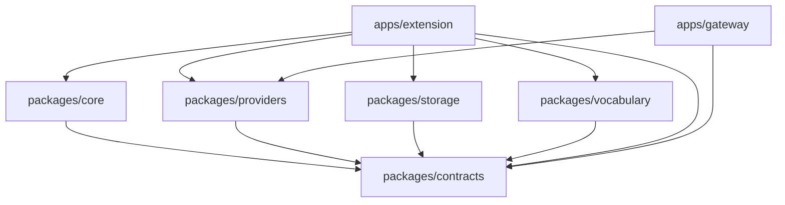

# TavernCanvas v3 Implementation Roadmap

> **For Codex:** Execute this roadmap with the `executing-plans` skill. Before Task 1, use `using-git-worktrees`. Execute the stage plans in order; do not combine stages or push partial work to the public repository.

**Goal:** Replace the legacy monolith with a clean-history TavernCanvas workspace that preserves v2 behavior, adds deterministic image-task binding, and ships a Vue workbench plus an optional LAN Gateway.

**Architecture:** A typed contracts package defines every boundary. A microkernel owns lifecycle and capability wiring. Host adapters, provider adapters, storage, prompt processing, UI, and Gateway communicate through commands, queries, and domain events. Browser persistence uses IndexedDB; Gateway persistence uses SQLite. The legacy archive is read-only migration input and never enters Git history or release artifacts.

**Tech Stack:** Node.js 24 LTS, pnpm 11.20.0, Vue 3.5.40, Vite 8.2.0, TypeScript 6.0.3, Zod 4.4.3, Reka UI 2.10.1, Vue I18n 11.4.8, Express 5.2.1, better-sqlite3 13.0.2, Vitest 4.1.10, and Playwright 1.62.1.

---

## 1. Non-negotiable execution rules

1. Start from an orphan `main` branch in an isolated worktree. The public repository must never receive legacy branches, tags, commits, or archive objects.
2. Keep `/home/ubuntu/code/st-chatu8/data/_archive/raw_st_chatu8_v2_8_1_20260804.tar.gz` outside the orphan worktree. Read it only when a migration or parity task explicitly requires legacy behavior.
3. Use test-driven development for contracts, state machines, parsers, migration, storage, providers, and Gateway routes. A task begins with a failing behavior test and ends with the narrow verification command in its stage plan.
4. Use a clean cutover. Do not add compatibility aliases, dual writes, legacy globals, or fallback imports. Legacy identifiers are permitted only in `tools/v2_migration` and migration fixtures.
5. UI components do not call `fetch`, access `extension_settings`, manipulate chat DOM, or import provider/storage implementations. They invoke typed capabilities.
6. Provider URLs, credentials, authorization headers, raw prompts, chat text, base64 images, and full upstream bodies never enter normal logs.
7. Every first-party icon comes from `lucide-vue-next`. Runtime code contains no Font Awesome, remote scripts, first-party emoji, or hand-authored SVG icons.
8. Do not create a stable release until every gate in Section 8 passes.

## 2. Stage plans

Execute these plans in this exact order:

| Stage | Plan | Deliverable | Blocking gate |
|---|---|---|---|
| 01 | `2026-08-04-tavern-canvas-01-foundation-host.md` | Orphan workspace, contracts, microkernel, host adapters, bootstrap, CI | Extension bootstrap contract tests and production bundle pass |
| 02 | `2026-08-04-tavern-canvas-02-generation-orchestration.md` | Anchors, tool/fallback triggers, queue, state machine, message binding | Parallel tool and fragmented fallback integration tests pass |
| 03 | `2026-08-04-tavern-canvas-03-providers-gateway.md` | Provider adapters, transports, Gateway API, security and recovery | Provider contract matrix and Gateway smoke scenario pass |
| 04 | `2026-08-04-tavern-canvas-04-persistence-migration.md` | IndexedDB repositories, content-addressed gallery, export/import, v2 migration | Copy-verify-switch rollback and image hash checks pass |
| 05 | `2026-08-04-tavern-canvas-05-vocabulary.md` | Versioned vocabulary package, builder, updater, Worker search | 500,000-tag correctness and performance budgets pass |
| 06 | `2026-08-04-tavern-canvas-06-vue-workbench.md` | Shadow-root Vue UI, bilingual locale, responsive shell, all operational views | Four-viewport browser and accessibility checks pass |
| 07 | `2026-08-04-tavern-canvas-07-parity-release.md` | Optional modules, parity closure, full E2E, bundle audit, release artifact | All acceptance criteria pass before first public push |

A stage is complete only after its plan's verification commands run successfully from a fresh process. Do not mark a stage complete from a previously cached output.

## 3. Target repository layout

```text
.
├── .github/
│   └── workflows/
│       ├── ci.yml
│       └── release.yml
├── manifest.json
├── i18n/
│   └── en.json
├── dist/
│   ├── index.js
│   ├── index.css
│   ├── chunks/
│   └── assets/
├── apps/
│   ├── extension/
│   │   ├── public/
│   │   │   ├── locales/
│   │   │   └── vocabulary/
│   │   ├── src/
│   │   │   ├── assets/
│   │   │   ├── bootstrap/
│   │   │   ├── host/
│   │   │   ├── modules/
│   │   │   ├── ui/
│   │   │   └── workers/
│   │   ├── package.json
│   │   ├── tsconfig.json
│   │   └── vite.config.ts
│   └── gateway/
│       ├── src/
│       │   ├── config/
│       │   ├── http/
│       │   ├── jobs/
│       │   ├── persistence/
│       │   └── providers/
│       ├── package.json
│       └── tsconfig.json
├── packages/
│   ├── contracts/
│   ├── core/
│   ├── providers/
│   ├── storage/
│   └── vocabulary/
├── tests/
│   ├── e2e/
│   ├── fixtures/
│   └── harness/
├── tools/
│   ├── bundle_budget/
│   ├── locale_check/
│   ├── v2_migration/
│   └── vocabulary_builder/
├── docs/
│   ├── plans/
│   └── superpowers/plans/
├── eslint.config.js
├── package.json
├── playwright.config.ts
├── pnpm-workspace.yaml
├── tsconfig.base.json
├── vite.config.shared.ts
└── vitest.config.ts
```

`docs/_dev/` and `data/_archive/` remain ignored local-only paths. Runtime packages cannot import either path.

SillyTavern clones the repository and reads `manifest.json` from the clone root. Root `manifest.json`, `i18n/`, and the release build under `dist/` are therefore the installable runtime. `apps/extension/` contains source only. CI byte-compares the committed runtime against a clean rebuild before release.

## 4. Package dependency direction



The graph is one-way. `packages/providers` cannot import storage or host code. `packages/storage` cannot import providers. `packages/core` receives boundary behavior through interfaces and capability registration.

## 5. Shared runtime contracts

All stage plans build on these stable identifiers:

```ts
export const protocol_version = "1.0" as const;

export const provider_ids = [
  "sd_webui",
  "novelai",
  "comfyui",
  "openai_image",
  "google_image",
] as const;

export const generation_states = [
  "queued",
  "preparing",
  "submitting",
  "running",
  "completed",
  "failed",
  "cancelled",
  "attached",
  "orphaned",
] as const;

export const provider_error_codes = [
  "auth_failed",
  "rate_limited",
  "content_blocked",
  "invalid_request",
  "provider_unavailable",
  "timed_out",
  "cancelled",
  "malformed_response",
] as const;
```

IDs are lowercase UUID strings generated with `crypto.randomUUID()`. Hashes are lowercase hexadecimal SHA-256. Timestamps are ISO 8601 UTC strings. Optional fields are omitted instead of serialized as `undefined`, which is required by `exactOptionalPropertyTypes`.

## 6. Global scripts and verification ownership

The root package exposes these commands by the end of Stage 07:

```json
{
  "scripts": {
    "build": "pnpm -r build",
    "check": "pnpm lint && pnpm format:check && pnpm typecheck && pnpm test",
    "lint": "eslint .",
    "format": "prettier --write .",
    "format:check": "prettier --check .",
    "typecheck": "pnpm -r typecheck",
    "test": "vitest run",
    "test:gateway": "vitest run --project gateway-integration",
    "test:e2e": "playwright test",
    "check:locale": "node tools/locale_check/dist/index.js",
    "check:bundle": "node tools/bundle_budget/dist/index.js",
    "check:first-party": "node tools/first_party_check/dist/index.js",
    "package:extension": "pnpm --filter @tavern-canvas/extension package",
    "verify:release": "pnpm check && pnpm build && pnpm test:gateway && pnpm test:e2e && pnpm check:locale && pnpm check:first-party && pnpm check:bundle && pnpm package:extension"
  }
}
```

Each stage runs only its focused checks during implementation. `verify:release` belongs to Stage 07 and is the sole release gate.

## 7. Commit sequence

Use Conventional Commits and keep commits independently buildable:

```text
chore(repo): establish TavernCanvas workspace
feat(contracts): define runtime boundary schemas
feat(core): add capability microkernel
feat(host): add supported host adapters
feat(generation): add anchored image request orchestration
feat(providers): add image provider adapters
feat(gateway): add persistent image job service
feat(storage): add browser repositories and gallery cache
feat(migration): add verified v2 import pipeline
feat(vocabulary): add versioned package search
feat(ui): add bilingual generation workbench
feat(parity): add optional legacy feature modules
chore(release): enforce release acceptance gates
```

Do not commit generated browser screenshots, temporary SQLite databases, legacy archives, secrets, downloaded provider responses, or local support bundles.

## 8. Final release gate

Run from a clean checkout of orphan `main` with Node 24 and the committed lockfile:

```bash
corepack enable
pnpm install --frozen-lockfile
pnpm verify:release
```

Then inspect the extension artifact, not the source tree:

```bash
pnpm exec node tools/release_audit/dist/index.js output/release/tavern-canvas.zip
```

The audit must report all of the following:

```text
legacy_paths=0
remote_runtime_scripts=0
font_awesome_references=0
first_party_emoji=0
manifest_dependency=JS-Slash-Runner
minimum_tavern_helper_version=4.9.1
locale_count=2
initial_js_gzip_bytes<=184320
initial_css_gzip_bytes<=40960
```

Before the first public push, prove the branch has one root and no legacy parent:

```bash
git rev-list --max-parents=0 main
git merge-base --is-ancestor legacy-upstream/main main
```

The first command must print exactly one TavernCanvas root commit. The second command must exit `1`. Only then push the new branch:

```bash
git push --set-upstream origin main
```

Do not use `--mirror`, `--all`, or `--tags` against `origin`.
